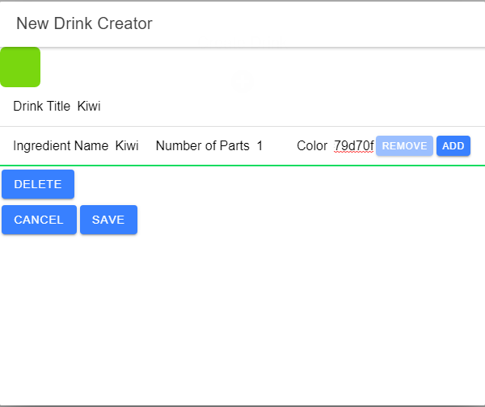

# Coffee Shop
This application is part od Udacity's Full-Stack Developer Nanodegree.
It's simple ionic application that manages coffee shop by allow users add, delete, edit ,and view drinks.

# Use Cases

> ## 1) Login
> Allow authorized staff to login via Auth0.

| 1) Login page |
| ------------- |
|   |
| 2) Auth0 login page  |
|   |
| 3) logout page  |
|   |

> ## 2) Browse drinks
> Allow all users to browse drinks.

| Drink menu for anonymous users |
| ------------- |
|   |
| Drink menu for authorized users  |
|   |

> ## 3) Add new drink
> Allow authorized staff to add new drink.

| Create new drink page |
| ------------- |
|   |

> ## 4) Edit existing drink
> Allow authorized staff to edit existing drink.

| Edit existing drink page |
| ------------- |
|   |

> ## 4) Delete existing drink
> Allow authorized staff to delete existing drink.

| Delete existing drink page |
| ------------- |
|   |